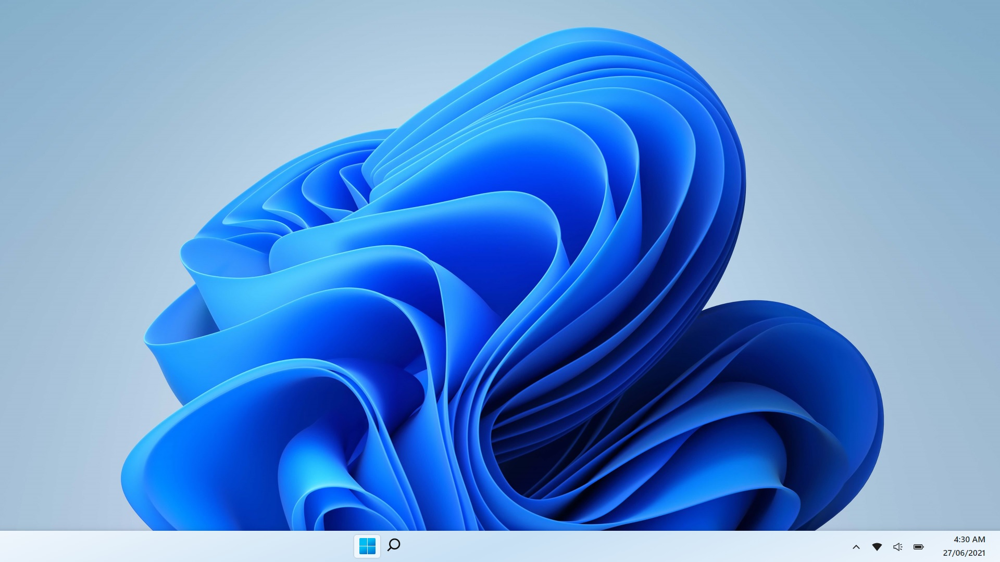
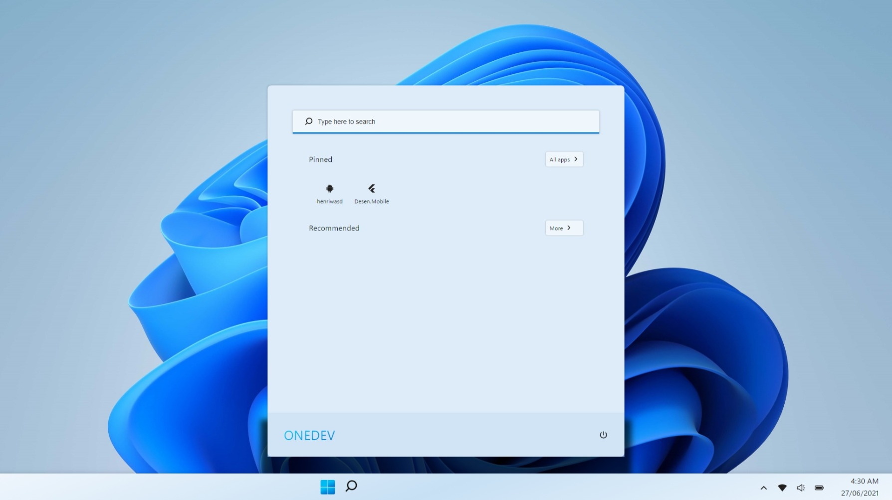

<p align="center">
  <p align="center">
    
  </p>
  <p align="center">
    <i>The home page of application</i>
  </p>
</p>

# Overview

Hello, this is an application created in my [Twicth lives](https://www.twitch.tv/onedev_), this is based on new Windows 11, a operational system, was created with React and some effects was create with pure **CSS**.

<p align="left">
  
  
</p>

The logo of new Windows 11 was recreated with pure css, see below

<p align="left">
      
</p>

# Installing
For install this app your should download this repository and open this in a terminal of your preference.
Now execute the following script:

```bash
  yarn install
  # OR
  npm install
```

Wait the installation completed, now execute the script below:

```bash
  yarn start
  # OR
  npm start
```

# Donate

For devs from Brazil, **Caso queira realizar uma doação, scaneia o QR Code abaixo, e muito obrigado sua doação vai ser transformada em muito codígo *010101010*, nos falamos nas lives!**

<p align="left">
  
</p>
